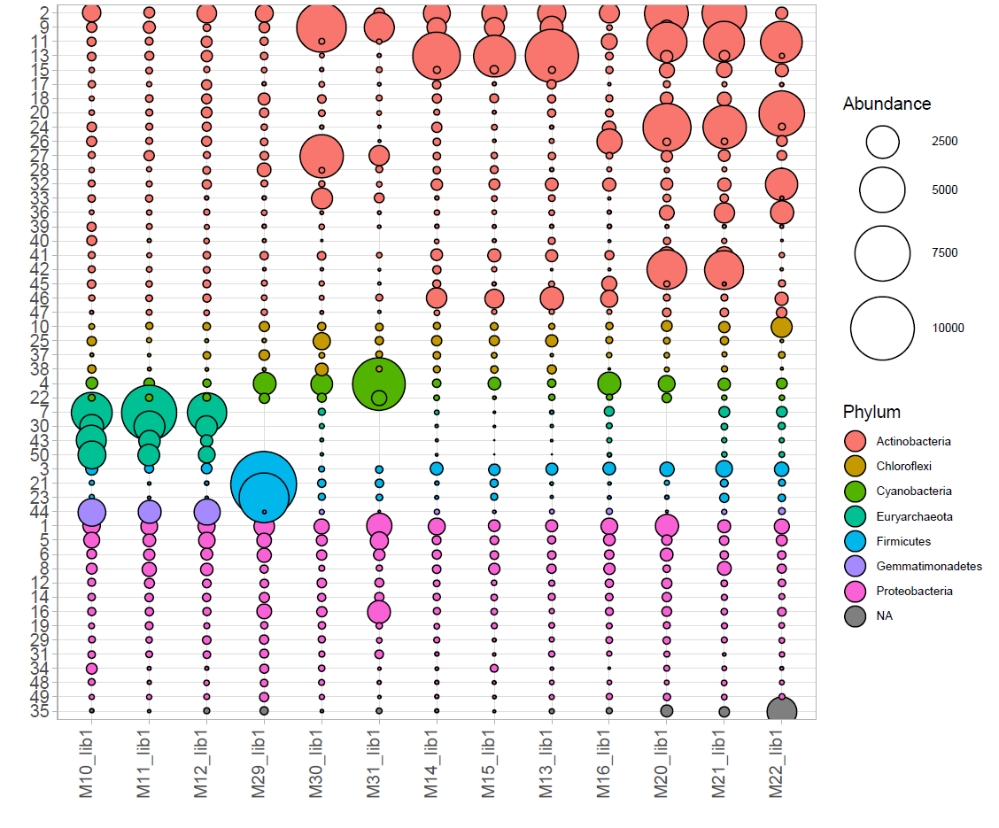
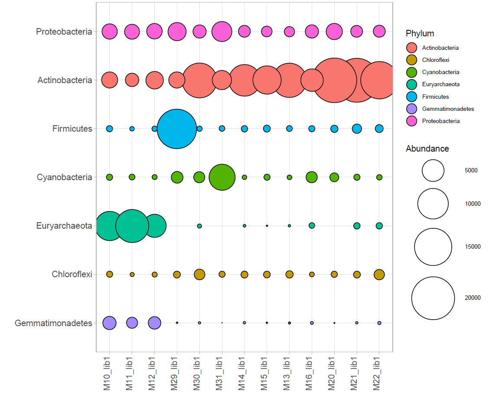

# BubblePlot
Create and customize bubble plots using ggplot2. You can create it in R or using the interactive Shiny app. The Shiny app can be started locally or can be found [here](http://shiny.raccoome.de/bubblePlot/).

<div style="float:left;">

</div>
<div style="float:left;">

</div>

## Installation
Dependencies can be installed using the install script.

```
source('install.R')
```

If you are working on Linux and `svglite` package installation fails try to install `cairo` and its devel packages for linux first.

 

