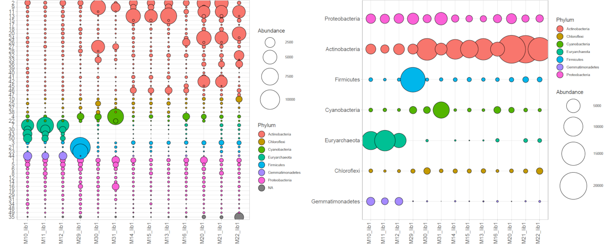

# BubblePlot
Create and customize bubble plots using ggplot2. You can create it in R or using the interactive Shiny app. The Shiny app can be started locally or can be found [here](http://shiny.raccoome.de/bubblePlot/).




## Installation
Dependencies can be installed using the install script.

```
source('install.R')
```

If you are working on Linux and `svglite` package installation fails try to install `cairo` and its devel packages for linux first.

## Shiny App
The Shiny app to generate bubble plots can be start using the common command:

```
shiny::runApp()
```

#### Data file loading
The data file loading procedure will be improved to be more intuitive. If you want to see correct ASV/OTU name in the plot, please make sure that they are present as rownames after data loading.

